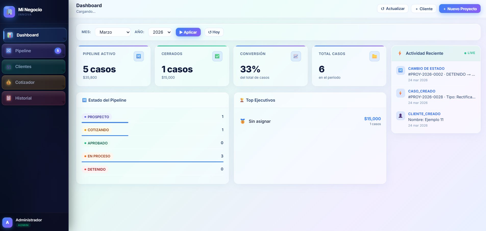
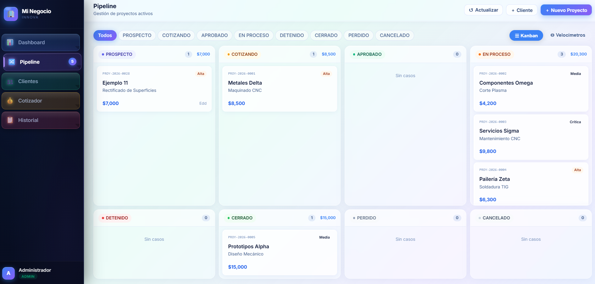
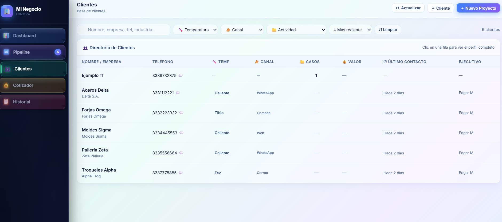
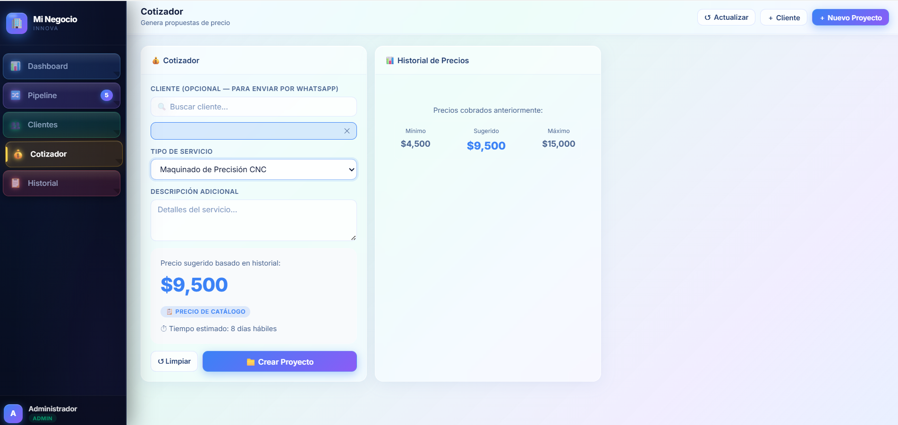
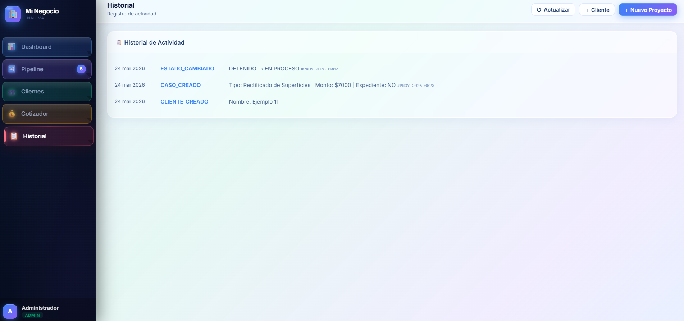

# 🏭 CRM Innova — Sistema de Gestión para Procesos Industriales

Sistema centralizado desarrollado con Google Apps Script para controlar clientes, cotizaciones y proyectos industriales en tiempo real.

---

## 🔥 Problema

En talleres y empresas industriales, la información suele estar dispersa entre WhatsApp, Excel y procesos manuales, lo que genera:

- Pérdida de seguimiento de clientes
- Errores en cotizaciones
- Desorden en proyectos en curso
- Falta de control operativo

---

## ⚡ Solución

CRM Innova centraliza toda la operación en un solo sistema:

- Gestión de clientes y contactos
- Control de proyectos (pipeline)
- Generación de cotizaciones
- Seguimiento en tiempo real
- Historial completo de acciones

---

## 🧩 Módulos principales

### 👥 Clientes
- Base de datos centralizada
- Información de contacto e industria
- Vinculación con carpetas de Google Drive

### 📊 Casos / Pipeline
- Control de proyectos en curso
- Estados: Prospecto, Cotizando, En Proceso, Cerrado
- Priorización y seguimiento

### 📦 Catálogo
- Registro de servicios
- Precios sugeridos
- Tiempos estimados
- Requerimientos técnicos

### 💰 Cotizaciones
- Generación de propuestas económicas
- Seguimiento de montos y estatus

### 📜 Historial
- Registro automático de acciones
- Auditoría y trazabilidad completa

### ⚙️ Configuración
- Gestión de usuarios
- Roles: Admin / Operador
- Parámetros del sistema

---

## 📸 Vista del sistema

---

## 🎯 Ideal para

- Talleres CNC
- Empresas de soldadura y pailería
- Mantenimiento industrial
- Negocios con proyectos personalizados

---

## 🚀 Tecnologías

- Google Apps Script
- Google Sheets
- HTML / JavaScript
- Google Drive

---

## 📲 ¿Te interesa este sistema?

Puedo adaptarlo a tu negocio.

👉 Contáctame: +52-333-973-2375
